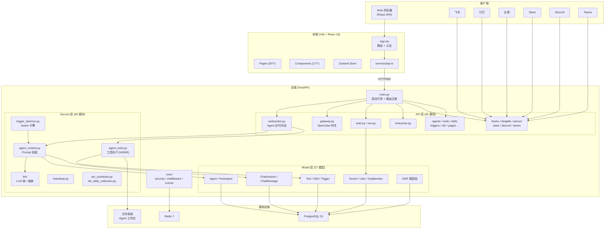
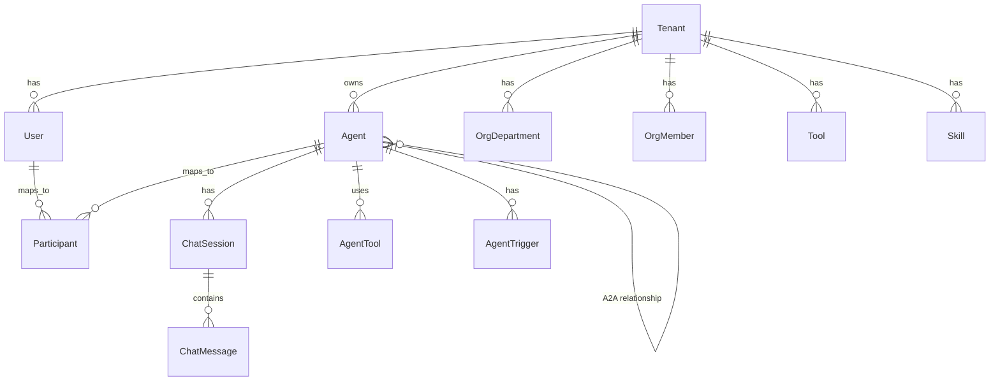
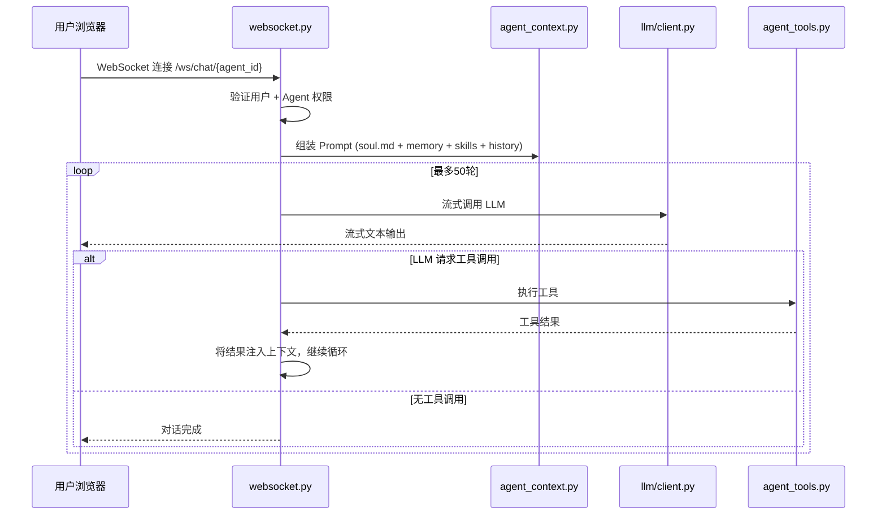
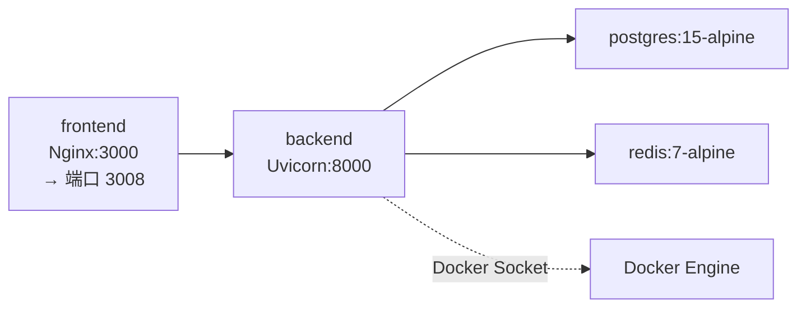

# Clawith 项目架构审查报告

> **审查日期**: 2026-04-30  
> **项目版本**: 参见 `backend/VERSION` / `frontend/VERSION`  
> **仓库**: https://github.com/dataelement/Clawith.git

---

## 1. 项目概述

Clawith 是一个开源的**多智能体协作平台**（"数字员工"系统），核心特点：

- 每个 Agent 拥有持久身份 (`soul.md`)、长期记忆 (`memory.md`)
- 自主意识引擎 (Aware Engine)：支持 cron/interval/webhook/on_message 触发器
- Agent 间通信 (A2A) 和全渠道人机交互
- 多租户 SaaS 架构，企业级管理控制面

---

## 2. 技术栈总览

| 层级 | 技术 |
|------|------|
| **后端** | Python 3.11+, FastAPI, SQLAlchemy 2.0 (async), PostgreSQL 15+, Redis 7+, Loguru |
| **前端** | React 19, TypeScript, Vite 6, Zustand 5, TanStack Query 5, React Router 7, i18next |
| **LLM** | 统一抽象层 (`services/llm/`)，支持 OpenAI / Anthropic / DeepSeek 等 |
| **渠道集成** | 飞书、钉钉、企微、Slack、Discord、Teams、WhatsApp、微信 |
| **部署** | Docker Compose, Helm (K8s), Nginx 反代 |
| **代码检查** | Ruff (Python), TypeScript strict mode |
| **测试** | pytest + pytest-asyncio |

---

## 3. 代码规模统计

| 区域 | 文件数 | 大小 |
|------|--------|------|
| **后端** (`backend/app/`) | 185 文件 | 2.94 MB |
| **前端** (`frontend/src/`) | 55 文件 | 2.42 MB |
| **测试** (`backend/tests/`) | 14 文件 | — |

### 超大文件 (需要关注)

| 文件 | 大小 | 说明 |
|------|------|------|
| `services/agent_tools.py` | **543 KB** | 所有工具实现，极度臃肿 |
| `pages/AgentDetail.tsx` | **487 KB** | 前端最大页面，Agent 工作台 |
| `pages/EnterpriseSettings.tsx` | **322 KB** | 企业设置页 |
| `services/tool_seeder.py` | **139 KB** | 内建工具注册种子 |
| `index.css` | **110 KB** | 全局样式（含所有主题/动画） |
| `pages/OKR.tsx` | **104 KB** | OKR 页面 |
| `api/okr.py` | **83 KB** | OKR API 路由 |
| `api/feishu.py` | **80 KB** | 飞书集成路由 |
| `services/org_sync_adapter.py` | **72 KB** | 组织同步适配器 |
| `api/enterprise.py` | **71 KB** | 企业管理路由 |

---

## 4. 整体架构图



---

## 5. 后端分层架构详解

### 5.1 入口 (`main.py`)

`main.py` 同时承担两个职责：

1. **路由组合根** — 注册 40 个 API 路由模块
2. **运维引导器** — 数据库建表、种子数据、后台任务启动

启动流程：
```
配置日志 → 检查安全密钥 → create_all 建表 → 种子默认租户
→ 种子工具 → 种子模板 → 种子技能 → 种子默认 Agent → 种子 OKR Agent
→ 启动后台任务(trigger_daemon, 飞书WS, 钉钉Stream, 企微Stream, 微信轮询, Discord GW)
→ 启动 ss-local 代理
```

### 5.2 API 层 (40 文件)

按领域划分的路由模块：

| 分类 | 模块 |
|------|------|
| **核心运行时** | `websocket.py`, `gateway.py` |
| **认证与身份** | `auth.py`, `sso.py`, `users.py` |
| **Agent 管理** | `agents.py`, `relationships.py`, `triggers.py` |
| **渠道适配** | `feishu.py`, `dingtalk.py`, `wecom.py`, `slack.py`, `discord_bot.py`, `teams.py`, `wechat.py`, `whatsapp.py` |
| **工具与技能** | `tools.py`, `skills.py` |
| **企业管理** | `enterprise.py`, `admin.py`, `tenants.py`, `organization.py` |
| **工作区** | `files.py`, `pages.py`, `upload.py` |
| **OKR** | `okr.py`, `schedules.py` |
| **其他** | `chat_sessions.py`, `messages.py`, `notification.py`, `webhooks.py`, `plaza.py`, `activity.py`, `agent_credentials.py`, `agentbay_control.py`, `tasks.py`, `advanced.py`, `atlassian.py`, `google_workspace.py` |

### 5.3 Service 层 (65 文件, 3 子目录)

核心服务：

| 服务 | 职责 |
|------|------|
| `agent_context.py` | Prompt 组装：soul.md + memory + 技能索引 + 关系 + 系统指令 |
| `agent_tools.py` | **543KB 巨型文件**：所有内建工具实现 (read_file, write_file, send_message 等) |
| `trigger_daemon.py` | Aware 引擎：定时评估触发器，构建唤醒上下文，调用 LLM |
| `heartbeat.py` | Agent 心跳管理 |
| `llm/client.py` | LLM 统一客户端 (82KB)，多提供商适配 |
| `llm/caller.py` | LLM 调用层，流式输出 + 错误处理 |
| `llm/failover.py` | 主备模型故障转移 |
| `tool_seeder.py` | 内建工具注册种子 (139KB) |
| `mcp_client.py` | MCP 协议客户端 |
| `resource_discovery.py` | Smithery / ModelScope 工具发现 |

### 5.4 Model 层 (27 模型文件)

核心数据模型：



**关键不变量**: 所有实体携带 `tenant_id`，所有查询必须按租户过滤。

### 5.5 Core 层 (7 文件)

| 文件 | 职责 |
|------|------|
| `security.py` | JWT 生成/验证, 密码哈希, 当前用户提取 |
| `middleware.py` | TraceId 中间件 |
| `permissions.py` | 权限检查 (org admin / platform admin) |
| `events.py` | Redis 连接管理 |
| `email.py` | 邮件发送 |
| `logging_config.py` | Loguru 配置 |

---

## 6. 前端架构详解

### 6.1 路由拓扑

```
/ → /plaza (默认重定向)
├── /login, /forgot-password, /reset-password, /verify-email (公开)
├── /sso/entry (SSO 登录)
├── /setup-company (新用户)
└── / (ProtectedRoute → Layout)
    ├── /dashboard
    ├── /plaza
    ├── /agents/new
    ├── /agents/:id/chat  ← AgentDetail (主工作台)
    ├── /agents/:id/settings  ← AgentDetail
    ├── /messages
    ├── /enterprise
    ├── /okr
    ├── /invitations
    └── /admin/platform-settings
```

### 6.2 页面规模

| 页面 | 大小 | 复杂度 |
|------|------|--------|
| `AgentDetail.tsx` | 487 KB | ⚠️ 极高 — 聊天、设置、触发器、工作区、A2A 全在一个文件 |
| `EnterpriseSettings.tsx` | 322 KB | ⚠️ 高 — 模型池、渠道、SSO、组织、设置 |
| `OKR.tsx` | 104 KB | 中高 |
| `Layout.tsx` | 68 KB | 中 — 侧边栏、导航、工作区切换 |
| `AdminCompanies.tsx` | 67 KB | 中 |
| 其余 15 个页面 | < 50 KB | 正常 |

### 6.3 状态管理

- **Zustand** (`stores/index.ts`, 1.4KB) — 轻量全局状态 (auth, token, user)
- **React Query** — 数据获取协调
- **API 客户端** (`services/api.ts`, 26KB) — 封装所有 HTTP/WS 请求

---

## 7. 核心运行时路径

### 7.1 WebSocket 对话循环



### 7.2 Aware 引擎 (触发器)

```
trigger_daemon (后台循环)
  → 每 tick 评估所有 enabled 触发器
  → 应用冷却/过期规则
  → 按 agent_id 分组触发
  → 构建唤醒上下文
  → 创建 reflection ChatSession
  → 复用 call_llm() 执行
  → 结果推送到用户 WebSocket
```

### 7.3 渠道适配模式

```
外部事件 → 映射身份到租户内部记录 → 解析/创建 ChatSession
→ 转换消息为标准格式 → 复用核心 LLM 执行路径 → 转换回渠道格式
```

---

## 8. 部署架构

### Docker Compose (4 服务)



- 后端挂载 Docker Socket (用于 OpenClaw 容器管理)
- 后端需要 `SYS_ADMIN` capability + `seccomp=unconfined` (用于 bubblewrap 沙箱)
- Helm charts 提供 K8s 部署方案

---

## 9. 架构问题与建议

### 🔴 严重问题

| # | 问题 | 位置 | 建议 |
|---|------|------|------|
| 1 | **`agent_tools.py` 543KB 巨型文件** | `services/agent_tools.py` | 按工具类别拆分为子模块 (file_tools, message_tools, code_tools 等) |
| 2 | **`AgentDetail.tsx` 487KB** | `pages/AgentDetail.tsx` | 拆分为 ChatPanel, SettingsPanel, TriggerPanel, WorkspacePanel 等子组件 |
| 3 | **`EnterpriseSettings.tsx` 322KB** | `pages/EnterpriseSettings.tsx` | 按 Tab 拆分为独立页面组件 |
| 4 | **`index.css` 110KB 单体样式** | `frontend/src/index.css` | 使用 CSS Modules 或按组件拆分 |

### 🟡 值得关注

| # | 问题 | 说明 |
|---|------|------|
| 5 | `main.py` 职责过重 | 既是路由注册中心又是启动引导器，建议拆分为 `routes.py` + `bootstrap.py` |
| 6 | `.agents/` 目录缺失 | AGENTS.md 引用的 `.agents/rules/` 和 `.agents/workflows/` 目录不存在 |
| 7 | Schemas 层过薄 | `schemas/` 仅 3 个文件 (18KB)，大量 Pydantic 模型可能内联在路由中 |
| 8 | 测试覆盖不足 | 14 个测试文件 vs 40 个 API 模块 + 65 个 Service 模块 |
| 9 | `tool_seeder.py` 139KB | 工具注册定义应考虑外部化为 YAML/JSON 配置 |
| 10 | 前端无 lint/format 配置 | `package.json` 中未配置 ESLint/Prettier |

### 🟢 架构优点

| 优点 | 说明 |
|------|------|
| **清晰的多租户隔离** | 所有实体 `tenant_id` 字段，查询统一过滤 |
| **统一的 LLM 抽象** | `llm/` 子模块封装良好，支持多提供商 + 故障转移 |
| **渠道适配模式一致** | 8 个渠道集成遵循相同的标准化流程 |
| **启动容错** | 每个种子步骤独立 try/except，单步失败不阻塞 |
| **Aware 引擎复用核心运行时** | 触发器不是独立执行引擎，而是核心 call_llm() 的唤醒层 |
| **工作区协作** | 文件修订历史 + 编辑锁 + 遍历安全 |

---

## 10. 目录结构速查

```
Clawith/
├── backend/
│   ├── app/
│   │   ├── main.py              # 入口：启动引导 + 路由注册
│   │   ├── config.py            # 配置 (Pydantic Settings)
│   │   ├── database.py          # SQLAlchemy async 引擎
│   │   ├── api/                 # 40 个路由模块
│   │   ├── models/              # 27 个 ORM 模型
│   │   ├── services/            # 65 个业务逻辑模块
│   │   │   ├── llm/             # LLM 统一抽象 (5 文件)
│   │   │   ├── sandbox/         # 代码执行沙箱
│   │   │   └── skill_creator_files/
│   │   ├── schemas/             # Pydantic 校验 (3 文件)
│   │   ├── core/                # 安全/中间件/事件 (7 文件)
│   │   ├── scripts/             # 管理脚本
│   │   └── templates/           # 邮件模板等
│   ├── alembic/                 # 数据库迁移
│   ├── agent_template/          # Agent 工作区模板
│   ├── agent_templates/         # 预制 Agent 模板
│   ├── tests/                   # 14 个测试文件
│   ├── pyproject.toml
│   └── Dockerfile
├── frontend/
│   ├── src/
│   │   ├── App.tsx              # 路由 + 认证
│   │   ├── main.tsx             # 入口
│   │   ├── index.css            # 全局样式 (110KB)
│   │   ├── pages/               # 20 个页面组件
│   │   ├── components/          # 17 个 UI 组件
│   │   ├── stores/              # Zustand 状态
│   │   ├── services/            # API 客户端
│   │   ├── hooks/               # React Hooks
│   │   ├── i18n/                # 国际化
│   │   ├── types/               # TypeScript 类型
│   │   └── utils/               # 工具函数
│   ├── package.json
│   └── Dockerfile
├── helm/                        # K8s Helm 部署
├── docker-compose.yml           # 本地开发部署
├── setup.sh / restart.sh        # 快速启动脚本
├── ARCHITECTURE_SPEC_EN.md      # 官方架构文档
├── AGENTS.md / CLAUDE.md        # AI Agent 指导文件
└── README.md (+ 多语言版本)
```
